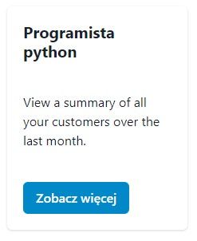
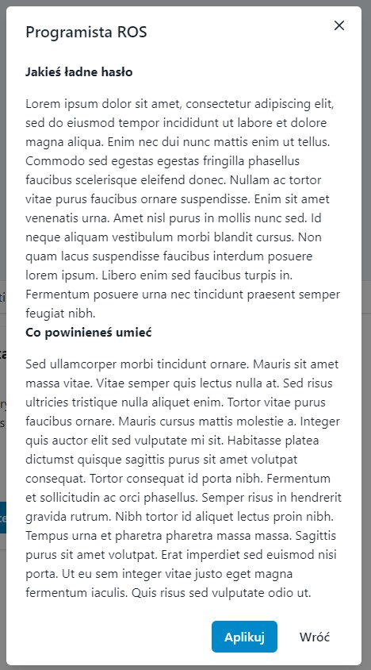

# Wstęp

**Przede wszystkim** - projekt jest bardzo okrojony, bardzo koncepcyjny i na razie ma służyć jako podstawa pod zaprojektowanie czegoś ładniejszego i sensowniejszego. Frontendowiec ze mnie marny, właściwie to nawet jakikolwiek endowiec. W każdym razie, popatrzcie, poczytajcie, jak macie ochotę to nawet uruchomcie to sami na swoim sprzęcie (poradnik na samym dole, wymaga next-js w wersji 13.5 i absolutnie nie nowszej, tłumaczenie w poradniku). Projekt korzysta z biblioteki [_chakra-ui_]{https://chakra-ui.com/docs/components}, która bardzo ułatwia budowanie stron od strony wizualnej, ale jednocześnie jest delikatnie okrojona w pewnych możliwościach, co też przedstawię poniżej.  

### Poruszanie się po stronie
**Zaczekaj chwilę**, gif się ładuje. Ma 75mb, więc readme potrzebuje paru sekund. Może parunastu, może nawet dłużej. 

### Elementy strony
1. _Wielki szary prostokąt na górze_ - magiczne miejsce na piękną grafikę, która sprawi, że odwiedzający będzie chciał spędzić na stronie miliony godzin po prostu patrząc na ten piękny komponent. Dobrze by było zrobić jakieś ładne zdjęcie zespołu, może jak pracuje nad czymś, może delikatnie wyblurować i dać logo. Albo nie blurować i skupić zainteresowanego na tym, co zdjęcie prezentuje. Sporo zależy od tego, co chcemy tam wsadzić. Na pewno co do tego elementu kilka zastrzeżeń przemyślen:
    - Wykorzystany komponent Flex (albo jakikolwiek inny, nawet własnoręcznie zbudowany, mało istotne) musi tam być zrobiony jako responsywny, więc będzie się dopasowywał do urządzenia. Tym samym, grafika musi być albo zaprojektowana tak, aby wyglądała wszędzie tak samo, albo tak, żeby wyglądała wszędzie **ładnie**. Niekoniecznie jedno musi być połączone z drugim, trzeba mieć na uwadze.
    - Na ten moment, jest ustawiona z góry narzucona przeze mnie wysokość 40vh, która po prostu dobrze wyglądała na urządzeniu, gdzie to robiłem. Trzeba by potestować, czy aby na pewno wszędzie będzie tak samo dobrze się prezentować. Z dawnych lat kojarze, że jednostka vh się jakoś dostosowywuje do strony, ale specjalistą nie jestem, więc nie wiem. Na 13" (i nieco szerszej rozdzielczości) wygląda dobrze, na 19" (kwadrat) już gorzej, więc się słabo przystosowuje. 
2. _Zakładki z nazwami działów_ - uważam, że przy naszej ilości stanowisk, na jakie zazwyczaj rekrutujemy, bez sensu jest bawić się w filtrowania czy sortowania przy wrzuconych wszystkich opisach w jedno miejsce. Podział na działy i nawigowanie po zakładkach będzie znacznie czytelniejsze i przede wszystkim **łatwiejsze** do stworzenia. Obserwując to na różnych sprzętach, wydaje mi się, że zakładki powinny być przede wszystkim większe i może jakieś różnokolorowe. 
3. _Karty ze stanowiskami_ - mnie się bardzo podoba taki koncept, wzięty rodem ze strony [rekrutacji Diehla]{https://www.diehl.com/career/en/jobs-application/job-offers/}, gdzie jedyne czego w kartach brakuje to ładnego paska, który zapełnia się na górze karty, generując przyjmną animację. Zamysł jest prosty, każda karta zawiera: tytuł stanowiska, bardzo bardzo bardzo krótki opis, który ma przykuć uwagę i przycisk _zobacz więcej_, który otwiera tzw. modala, który jest punktem 4 w tej rozpisce. Początkowo myślałem o dodaniu do karty zdjęcia, ale wydaje mi się to trochę za dużo, proste rozwiązanie jest przyjemniejsze dla oka.

4. _Modal_ - tworzenie podstron wydaje mi się niepotrzebne dla tak małej liczby stanowisk, jaką mamy, także postanowiłem zastąpić to wyskakującym okienkiem. Jest to rozwinięcie karty ze stanowiskiem. Mój pomysł jest taki, aby zawierało:
    - Tytuł stanowiska
    - Jakieś ładne hasło wraz z opisem co tam robimy
    - Co powinien rekrut ogarniać
    - Jakiś odnośnik do zadań rekrutacyjnych, aby śledzić ile osób w nie klika, ale to do ustalenia, czy na tym etapie, czy przy formularzu
    - zdjęcie, duże, po prawej stronie
    - dwa przyciski: aplikuj (oczywiste - formularz) i wróć (również oczywiste)

5. _Stopka_ - wiadomo o co chodzi, myślę, że można zrobić albo taką małą, skromną, albo dać taką, gdzie będzie logo i odnośniki i logo polibudy i takie tam.

### Poradnik odpalenia strony

**Nie jest to najprostsze**, głównie dlatego, że chakra nie działa na next-js w wersji 14 i nowszych (nie wiem czemu), więc trzeba zmusić create-next-app do zainstalowania starszej wersji. Do przeglądania kodu zalecam **Visual Studio Code**, które dobrze radzi sobie z typescriptem i next-js. Należy też zainstalować node-js oraz npm. 
1. Odpalamy terminal, wpisujemy komendę _npx create-next-app@13_, jeśli coś wam nie działa to piszcie do mnie, albo wpisujcie błąd w neta. 
2. Wszystko odpalamy domyślnie, tak jak w tym [poradniku]{https://www.youtube.com/watch?v=ZVnjOPwW4ZA} w **8:50**.
3. Jak wszystko się zainstaluje, instalujemy chakrę komendą _npm i @chakra-ui/react @emotion/react @emotion/styled framer-motion_.
4. Upewnijcie się, że next-js jest w wersji 13.5, albo niższej. Jeśli nie jest, wpisujecie komendę _npm i next@13_.
5. Odpalcie kontrolę wersji i sklonujcie przez gita, albo przerzucacie pliki z folderu **app** do siebie. Reszte plików usuwacie, najlepiej zróbcie to w pierwszej kolejności, żeby nie było żadnych konfliktów. 
6. Zapisujecie wszystko w visualu, odpalacie terminal i ostatnia komenda _npm run dev_. Strona hostuje się domyślnie na porcie 3000 i powinna być dostępna pod adresem _http://localhost:3000_.

Dlaczego chakra? Jest prosta w obsłudze. Dla każdego. Naprawdę. W dodatku komponenty są ładne i podobno da się je świetnie customować. Problem jest tylko przy budowaniu funkcji z parametrami. Natomiast wiem, że da się to jakoś zrobić, po prostu ja nie umiem. 
Dlaczego  next-js? Pomyślałem, że jeśli nasza główna strona jest na niego przepisywana, w dodatku jest bardzo rozbudowany i można w nim działać cuda, nawet bez bibliotek, to może warto by skorzystać z takiego narzędzia, zamiast męczyć się z czymś słabszym.

### Dalsze plany na stronę

**Na pewno** trzeba zbudować formularz, już raczej w formie podstrony. Trzeba się zastanowić, czy chcemy osobny dla każego działu, czy dać jeden z listami, które się rozwijają w zależności od wyborów. Do przemyślenia, ale to już bardziej zaawansowana sprawa. Zwłaszcza, że trzeba zrobić backend, który będzie wysyłał maile. Trzeba też zrobić śledzenie użytkowników, bo o to głównie nam w tej stronie chodzi, czyli o budowanie statystyk. 